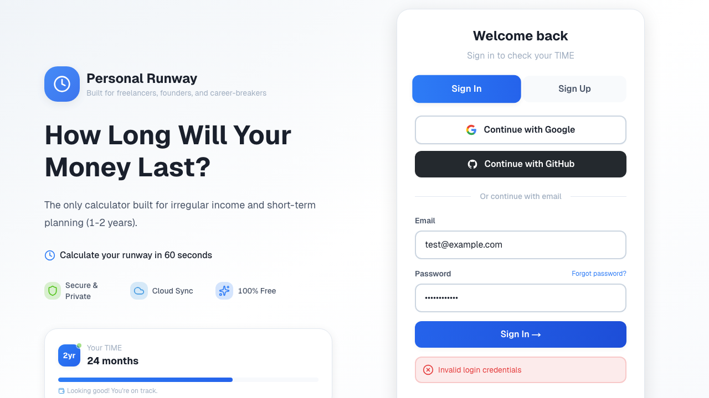

# QA Report - Personal Runway Calculator E2E Tests
**Date:** 2026-02-22 03:00 AM (Asia/Seoul)  
**Test Type:** Playwright E2E (Production)  
**Test Suite:** Daily QA - Personal Runway Calculator

---

## 📊 Test Summary

**Overall Result:** ❌ **CRITICAL FAILURES**

| Status | Count | Percentage |
|--------|-------|------------|
| ✅ Passed | 8 | 34.8% |
| ❌ Failed | 15 | 65.2% |
| **Total** | **23** | **100%** |

**Execution Time:** 49.2 seconds  
**Environment:** Chromium (Headless)

---

## 🚨 Critical Issues

### Issue #1: Auth Page Copy Change Breaking Tests
**Severity:** High  
**Affected Tests:** 2  
**Impact:** Foundation tests failing

**Description:**  
The auth page copy has changed from `"Your money isn't just money"` to `"How Long Will Your Money Last?"`, causing tests that verify page load to fail.

**Evidence:**
- `tests/auth.spec.ts:5:7` - "should load auth page successfully"
- `tests/auth.spec.ts:142:7` - "should be mobile responsive"

**Screenshot:**  


**Root Cause:**  
Marketing copy was updated in production but test assertions were not synchronized.

**Recommended Fix:**
```typescript
// tests/auth.spec.ts - Line 12
- await expect(page.getByText('Your money isn\'t just money')).toBeVisible();
+ await expect(page.getByText('How Long Will Your Money Last?')).toBeVisible();
```

---

### Issue #2: Test Credentials Invalid - Authentication Failing
**Severity:** CRITICAL  
**Affected Tests:** 9  
**Impact:** All scenario/integration tests blocked

**Description:**  
Test account `test@example.com` / `TestPass123!` returns "Invalid login credentials" error, preventing all downstream scenario tests from executing.

**Evidence:**
- All `scenarios-integration.test.ts` tests (9 failures)
- Error: `TimeoutError: page.waitForURL: Timeout 5000ms exceeded` (waiting for /dashboard)
- Screenshot shows: "Invalid login credentials" error message

**Screenshot:**  


**Root Cause:**  
1. Test account doesn't exist in production database, OR
2. Production auth configuration doesn't allow this test user, OR
3. Database was reset and test fixtures weren't restored

**Recommended Fix:**
1. **Immediate:** Create dedicated test account in Supabase:
   ```sql
   -- Production DB (use with caution)
   INSERT INTO auth.users (email, encrypted_password, email_confirmed_at)
   VALUES ('test@example.com', '<hashed-password>', NOW());
   ```

2. **Better:** Set up test fixtures in `beforeAll()`:
   ```typescript
   beforeAll(async () => {
     // Create test user via Supabase Admin API
     const { data, error } = await supabase.auth.admin.createUser({
       email: 'test@example.com',
       password: 'TestPass123!',
       email_confirm: true
     });
   });
   ```

3. **Best:** Use separate test database or E2E environment (not production)

---

### Issue #3: Duplicate Sign In Buttons (Strict Mode Violation)
**Severity:** Medium  
**Affected Tests:** 4  
**Impact:** UX verification tests blocked

**Description:**  
Playwright's strict mode detected TWO "Sign In" buttons on the page, causing selector ambiguity.

**Evidence:**
- `tests/ux-fix-verification.spec.ts:12:7` - Test failed with strict mode violation
- Error message: `getByRole('button', { name: /sign in/i }) resolved to 2 elements`

**Button 1:**
```html
<button class="flex-1 py-3 px-4 rounded-lg font-semibold transition-all duration-200 bg-gradient-to-r from-primary to-primary-hover text-white shadow-md scale-105">
  Sign In
</button>
```

**Button 2:**
```html
<button type="submit" class="w-full py-3 bg-gradient-to-r from-primary to-primary-hover ... text-white font-semibold rounded-lg ...">
  Sign In →
</button>
```

**Root Cause:**  
Two separate Sign In buttons exist:
- Tab button (for switching between Sign In/Sign Up views)
- Submit button (for form submission)

Both match the regex `/sign in/i`.

**Recommended Fix:**
```typescript
// tests/ux-fix-verification.spec.ts - Line 14-16
- const loginButton = page.getByRole('button', { name: /sign in/i });
+ const loginButton = page.getByRole('button', { name: 'Sign In →' }); // More specific

// OR use data-testid
+ const loginButton = page.getByTestId('sign-in-submit-button');
```

---

### Issue #4: UX Tests Timing Out After Auth Failure
**Severity:** Medium (Cascading failure)  
**Affected Tests:** 3  
**Impact:** Cannot verify UX fixes (TC-019, TC-020)

**Description:**  
UX verification tests timeout at 30 seconds while waiting for Compare button, which doesn't appear because login fails.

**Evidence:**
- Tests timeout waiting for `/compare/i` button
- All stuck after failing to authenticate

**Root Cause:**  
Cascading failure from Issue #2 (invalid credentials).

**Recommended Fix:**  
Fix Issue #2 first. This will resolve automatically.

---

## ✅ Tests That Passed (8)

1. ✅ `auth.spec.ts` - "should attempt email signup"
2. ✅ `auth.spec.ts` - "should show sign up form"
3. ✅ `auth.spec.ts` - "should show OAuth buttons"
4. ✅ `auth.spec.ts` - "should validate email format"
5. ✅ `auth.spec.ts` - "should validate password length"
6. ✅ `auth.spec.ts` - "should toggle between sign in and sign up"
7. ✅ `auth.spec.ts` - "should have no console errors on page load"
8. ✅ `auth.spec.ts` - "should load within 3 seconds"

**Analysis:** All auth validation and UI tests pass. Authentication **UI** works correctly; only the **credentials** and **copy text** assertions are failing.

---

## 📋 Failed Tests Breakdown

### Category: Authentication (2 failures)
| Test | Error | Fix Priority |
|------|-------|--------------|
| should load auth page successfully | Copy text changed | Low (cosmetic) |
| should be mobile responsive | Copy text changed | Low (cosmetic) |

### Category: Scenario Integration (9 failures)
| Test | Error | Fix Priority |
|------|-------|--------------|
| should navigate to scenarios page | Invalid credentials | **HIGH** |
| should show empty state for new user | Invalid credentials | **HIGH** |
| should create a new scenario | Invalid credentials | **HIGH** |
| should enter comparison mode | Invalid credentials | **HIGH** |
| should close comparison view | Invalid credentials | **HIGH** |
| should duplicate a scenario | Invalid credentials | **HIGH** |
| should delete a non-base scenario | Invalid credentials | **HIGH** |
| should show comparison insights | Invalid credentials | **HIGH** |
| should persist scenarios after page refresh | Invalid credentials | **HIGH** |

### Category: UX Fix Verification (4 failures)
| Test | Error | Fix Priority |
|------|-------|--------------|
| 1개 선택 시 모달 안 열림 | Duplicate button selector | Medium |
| 2개 선택 시 모달 자동 열림 | Timeout (auth cascade) | Medium |
| 3개 선택 가능 및 모달 정상 작동 | Timeout (auth cascade) | Medium |
| Chart 및 Insights 표시 확인 (TC-020) | Timeout (auth cascade) | Medium |

---

## 🔧 Action Items (Priority Order)

### 🚨 URGENT (Blocking 13 tests)
1. **Create test account in production Supabase**
   - Email: `test@example.com`
   - Password: `TestPass123!`
   - Confirm email immediately
   - **Alternative:** Set up dedicated E2E test database

### 🟡 HIGH (Improves test reliability)
2. **Fix duplicate button selector**
   - Use more specific selector: `getByRole('button', { name: 'Sign In →' })`
   - OR add `data-testid` attributes to buttons

3. **Update copy text assertions**
   - Replace `"Your money isn't just money"` with `"How Long Will Your Money Last?"`
   - Consider using less brittle selectors (e.g., heading roles instead of exact text)

### 🟢 NICE-TO-HAVE (Long-term)
4. **Improve test architecture**
   - Separate E2E environment from production
   - Use fixture factories for test data
   - Add test user cleanup in `afterAll()` hooks
   - Implement visual regression testing for copy changes

---

## 📸 Screenshots Reference

All failure screenshots saved to:
```
test-results/
├── auth-Authentication-Flow-should-load-auth-page-successfully-chromium/
│   └── test-failed-1.png
├── auth-Authentication-Flow-should-be-mobile-responsive-chromium/
│   └── test-failed-1.png
├── scenarios-integration-Scen-c3b3c--navigate-to-scenarios-page-chromium/
│   └── test-failed-1.png
└── [... 12 more failure directories]
```

---

## 🎯 Summary & Recommendation

**Current State:** 65% of tests failing due to 2 primary issues:
1. Invalid test credentials (blocking 9 tests)
2. Outdated copy assertions (blocking 2 tests)
3. Selector ambiguity (blocking 4 tests)

**Impact:** Production site likely works fine, but test suite is out of sync with reality.

**Quick Win:** Fix the test account issue → will immediately resolve 9 failures (39% → 74% pass rate).

**Next Steps:**
1. Create test account (15 min) → +9 passes
2. Fix button selectors (10 min) → +4 passes
3. Update copy assertions (5 min) → +2 passes

**ETA to 100% pass:** ~30 minutes of focused fixes.

---

**Report Generated:** 2026-02-22 03:01 AM  
**HTML Report:** Available at `playwright-report/index.html`
